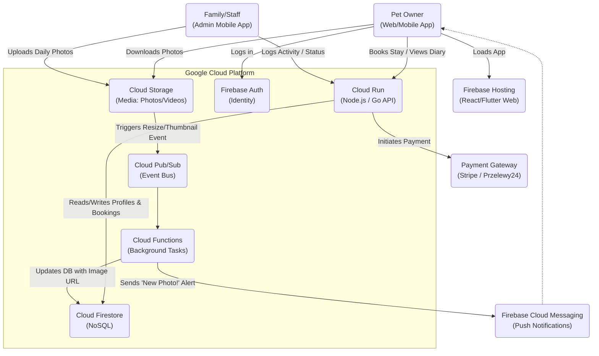

# Technical Architecture: The "Pet-Diary" App (GCP)

This diagram outlines the Serverless Google Cloud architecture used to manage bookings, securely store pet data, and deliver the "Curated Daily Diary" (photos/videos) to owners.

### Key Components:
1. **Firestore:** Stores structured data (Pet Profiles, Vaccination expiries, Booking dates, "Diary" text entries).
2. **Cloud Storage:** Stores the high-res photos and videos taken by the family.
3. **Cloud Functions:** Triggers automatically when a new photo is uploaded, creates a thumbnail, and sends a Push Notification to the owner's phone saying "Fido is having a great time! Tap to see today's photo."
