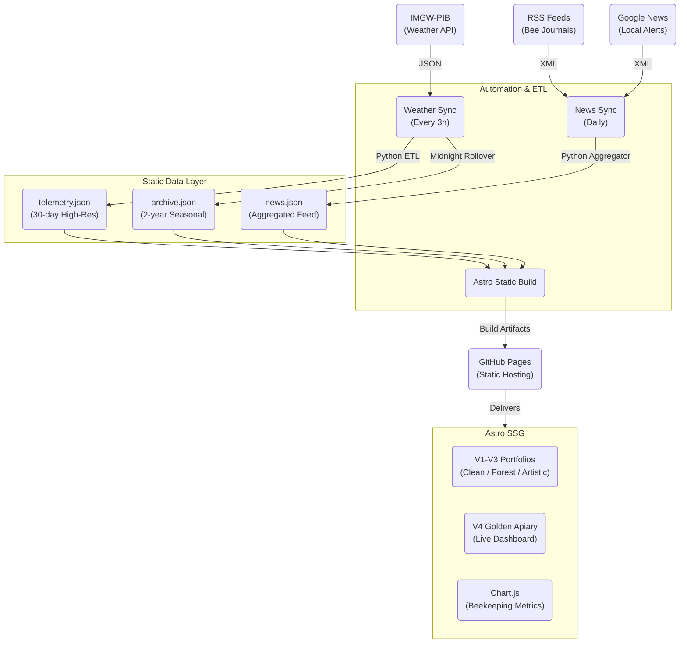

# Technical Architecture: The Golden Apiary & Pet Hotel

This document outlines the high-performance, 100% static architecture used to deliver live beekeeping telemetry and a multi-version design portfolio.

### 1. The Data Pipeline (ETL)
The application uses a **"Static-Dynamic"** pattern. While the site is 100% static, it is rebuilt frequently to reflect fresh data.
- **Weather ETL (`fetch_weather.py`):** Fetches data from IMGW-PIB every 3 hours. It calculates specialized beekeeping metrics like **GDD (Growing Degree Days)** and **Delta T (Nectar Flow Index)**.
- **News Aggregator (`fetch_news.py`):** Runs daily to pull the latest industry updates and hyper-local alerts for the Wołomin area.
- **Midnight Rollover:** The system automatically summarizes hourly telemetry into daily historical records in `archive.json`.

### 2. Multi-Version Design Core
The project serves four distinct design identities from a single codebase:
- **V1 (Professional):** Trust-focused, clean layout.
- **V2 (Forest Boutique):** Luxury aesthetic with organic elements.
- **V3 (Experimental):** Broken grids and cinematic interactions.
- **V4 (Golden Apiary):** High-utility beekeeping dashboard with physics-based UI elements.

### 3. Beekeeping Intelligence (V4)
The V4 dashboard implements specific biological logic:
- **Foraging Window:** Logic-driven status (Optimal/Marginal/Restricted) based on temperature, wind (>20 km/h), and precipitation.
- **Thermal Envelope:** Comparative visualization of current temp vs. 24h rolling min/max.
- **Nectar Washout:** Tracking rainfall impact on nectar availability (48h recovery logic).

### 4. Technical Stack
- **Framework:** Astro (Static Site Generation)
- **Styling:** Tailwind CSS (Utility-first)
- **Visuals:** Chart.js (Telemetry), Mermaid.js (Architecture Diagrams)
- **Hosting:** GitHub Pages
- **Interactivity:** Vanilla JS (Magnetic physics, bee-cursor)
